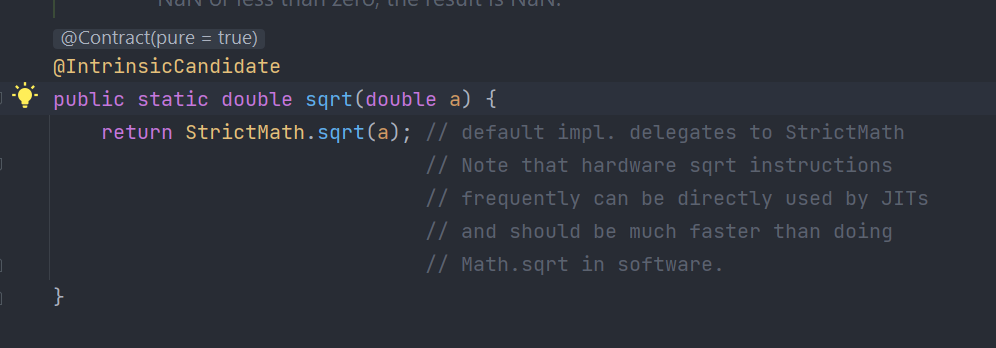

## Phương thức là gì?

Một phương thức trong Java là một tập hợp các lệnh mà được nhóm cùng với nhau để thực hiện một hành động nào đó  
Các phương thức liên kết với một class và chúng định nghĩa hoạt động của class đó  

## Các loại phương thức  
Dựa vào việc phương thức được định nghĩa bởi người dùng hay có sẵn trong thư viện chuẩn, ta có thể chia ra thành hai loại:  
- Phương thức của thư viện chuẩn
- Phương thức do người dùng tự định nghĩa  

### Phương thức của thư viện chuẩn
Phương thức của thư viện chuẩn là các phương thức được tích hợp trong Java và có thể gọi ra sử dụng. ác thư viện đính kèm với thư viện Class (JCL) trong tệp lưu trữ Java (*.jar) cùng với JVM và JRE.   

Ví dụ như trong các bài trước, để dữ liệu ra console chúng ta đã sử dụng phương thức `println()` nằm trong lớp `PrintStream`    

.png)  

Hay ví dụ như để tính căn bậc hai, ta cũng sử dụng tới phương thức `sqrt()` nằm trong lớp `Math`  




### Phương thức do người dùng định nghĩa  

Bạn cũng có thể định nghĩa các phương thức bên trong một class theo ý muốn. Các phương thức này được gọi là phương thức do người dùng định nghĩa  

Cú pháp của một phương thức như sau:  

```java
<modifier> <returnType> <nameOfMethod> (parameters){
    //method body
} 
```

Hoặc:  


Trong đó:  
- `modifier`: Là phạm vi truy cập của phương thức (Các bạn có thể xem chi tiết hơn trong các bài sau)  
- `returnType`: Kiểu dữ liệu trả về, phương thức có thể trả về một giá trị có kiểu dữ liệu nguyên thuỷ như (int, float, char, ...) hoặc kiểu dữ liệu tham chiếu (String,...). Trong trương hợp không trả về dữ liệu nào thì sử dụng `void` (Kiểu trả về của nó là rỗng)  
- `nameOfMethod`: Tên của phương thức  
- `parameters`: Các tham số là giá trị được truyền vào của một phương thức. 
- `method body`: Phần thân của phương thức

## Phương thức static
Khi bạn khai báo một phương thức là static thì phương thức đó được gọi là phương thức static (Phương thức tĩnh)  
```java
<modifier> static <returnType> <nameOfMethod> (parameters){
    //method body
} 
```

- `static`: Nếu bạn sử dụng từ khoá `static` trong một phương thức thì nó sẽ trở thành phương thức tĩnh. Phương thức tĩnh có thể được gọi mà không cần phải tạo đối tượng (Chúng ta sẽ được tìm hiểu chi tiết về từ khoá này trong các bài sau)  
- Phương thức này thuộc về lớp chứ không phải đối tượng của lớp  
- Phương thức static có thể truy cập biến static và có thể thay đổi giá trị của nó.

Tuy nhiên, phương thức static không thể sử dụng biến non-static hoặc gọi trực tiếp phương thức non-static

## Gọi phương thức trong java  
Để sử dụng một phương thức, phương thức đó cần phải được gọi